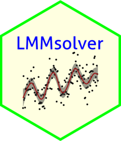

<!-- README.md is generated from README.Rmd. Please edit that file -->

```{r, include = FALSE}
knitr::opts_chunk$set(
  collapse = TRUE,
  comment = "#>",
  fig.path = "man/figures/README-",
  out.width = "70%"
)
```

# LMMsolver 

[](https://www.r-pkg.org/pkg/LMMsolver)
[](https://www.r-pkg.org/pkg/LMMsolver)
[](https://github.com/Biometris/LMMsolver/actions?workflow=R-CMD-check)
[](https://app.codecov.io/gh/Biometris/LMMsolver)
[](https://doi.org/10.5281/zenodo.14527379)

The goal of the `LMMsolver` package is to fit (generalized) linear mixed models 
efficiently when the model structure is large or sparse. It provides tools for 
estimating variance components using restricted maximum likelihood (REML) and 
is designed for models that involve many random effects or smooth terms.

A key feature of the package is support for smoothing using P-splines. LMMsolver 
uses a sparse formulation [@boer2023], which makes computations fast and memory 
efficient, especially for two-dimensional smoothing problems such as spatial 
surfaces or image-like data [@boer2023; @carollo2024].

This makes `LMMsolver` particularly useful for applications involving spatial or 
temporal smoothing, large data sets, and models where standard mixed model tools 
become slow or impractical.

## Installation

* Install from CRAN:

```{r, eval = FALSE}
install.packages("LMMsolver")
```

* Install latest development version from GitHub (requires [remotes](https://github.com/r-lib/remotes) package):

```{r, eval = FALSE}
remotes::install_github("Biometris/LMMsolver", ref = "develop", dependencies = TRUE)
```

## Example

As an example of the functionality of the package we use the `USprecip` data set in the `spam` package [@Furrer2010].

```{r USprecip data}
library(LMMsolver)
library(ggplot2)

## Get precipitation data from spam
data(USprecip, package = "spam")

## Only use observed data.
USprecip <- as.data.frame(USprecip)
USprecip <- USprecip[USprecip$infill == 1, ]
head(USprecip[, c(1, 2, 4)], 3)
```

A two-dimensional P-spline can be defined with the `spl2D()` function, with longitude and latitude as covariates, and anomaly (standardized monthly total precipitation) as response variable:

```{r runobj}
obj1 <- LMMsolve(fixed = anomaly ~ 1,
                 spline = ~spl2D(x1 = lon, x2 = lat, nseg = c(41, 41)),
                 data = USprecip)
```

The spatial trend for the precipitation can now be plotted on the map of the USA, using the `predict` function of `LMMsolver`: 

```{r Plot_USprecip, fig.alt="Precipitation anomaly USA"}
lon_range <- range(USprecip$lon)
lat_range <- range(USprecip$lat)
newdat <- expand.grid(lon = seq(lon_range[1], lon_range[2], length = 200),
                      lat = seq(lat_range[1], lat_range[2], length = 300))
plotDat <- predict(obj1, newdata = newdat)

plotDat <- sf::st_as_sf(plotDat, coords = c("lon", "lat"))
usa <- sf::st_as_sf(maps::map("usa", regions = "main", plot = FALSE))
sf::st_crs(usa) <- sf::st_crs(plotDat)
intersection <- sf::st_intersects(plotDat, usa)
plotDat <- plotDat[!is.na(as.numeric(intersection)), ]

ggplot(usa) + 
  geom_sf(color = NA) +
  geom_tile(data = plotDat, 
            mapping = aes(geometry = geometry, fill = ypred), 
            linewidth = 0,
            stat = "sf_coordinates") +
  scale_fill_gradientn(colors = topo.colors(100))+
  labs(title = "Precipitation (anomaly)", 
       x = "Longitude", y = "Latitude") +
  coord_sf() +
  theme(panel.grid = element_blank())
```

Further examples can be found in the vignette.
```r
vignette("Solving_Linear_Mixed_Models")
```

## References
