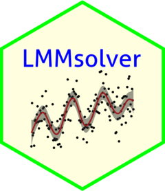
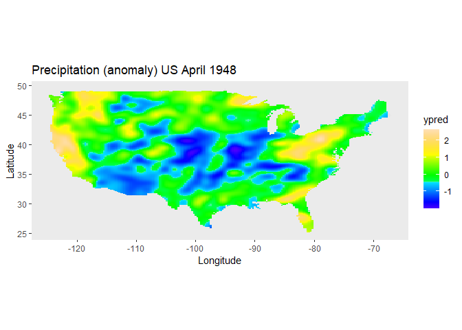

<!-- README.md is generated from README.Rmd. Please edit that file -->

# LMMsolver 

[](https://www.r-pkg.org/pkg/LMMsolver)
[](https://www.r-pkg.org/pkg/LMMsolver)
[](https://github.com/Biometris/LMMsolver/actions?workflow=R-CMD-check)
[](https://app.codecov.io/gh/Biometris/LMMsolver)
[](https://doi.org/10.5281/zenodo.14527379)

The aim of the `LMMsolver` package is to provide an efficient and
flexible system to estimate variance components using restricted maximum
likelihood or REML (Patterson and Thompson 1971), for models where the
mixed model equations are sparse. An important feature of the package is
smoothing with P-splines (Eilers and Marx 1996). The sparse mixed model
P-splines formulation (Boer 2023) is used, which makes the computations
fast. The computational advantage of the sparse mixed model formulation
is especially clear for two-dimensional smoothing (Boer 2023; Carollo et
al. 2024).

<!-- The aim of the `LMMsolver` package is to provide an efficient and flexible system to estimate variance components using restricted maximum likelihood or REML [@Patterson1971], for models where the mixed model equations are sparse [@boer2023]. An example of an application is using splines to model spatial [@Rodriguez-Alvarez2018; @Boer2020] or temporal [@Bustos-Korts2019] trends. Another example is mixed model Quantitative Trait Locus (QTL) analysis for multiparental populations, allowing for heterogeneous residual variance and design matrices with Identity-By-Descent (IBD) probabilities [@Li2021]. -->

## Installation

- Install from CRAN:

``` r
install.packages("LMMsolver")
```

- Install latest development version from GitHub (requires
  [remotes](https://github.com/r-lib/remotes) package):

``` r
remotes::install_github("Biometris/LMMsolver", ref = "develop", dependencies = TRUE)
```

## Example

As an example of the functionality of the package we use the `USprecip`
data set in the `spam` package (Furrer and Sain 2010).

``` r
library(LMMsolver)
library(ggplot2)

## Get precipitation data from spam
data(USprecip, package = "spam")

## Only use observed data.
USprecip <- as.data.frame(USprecip)
USprecip <- USprecip[USprecip$infill == 1, ]
head(USprecip[, c(1, 2, 4)], 3)
#>      lon   lat  anomaly
#> 6 -85.95 32.95 -0.84035
#> 7 -85.87 32.98 -0.65922
#> 9 -88.28 33.23 -0.28018
```

A two-dimensional P-spline can be defined with the `spl2D()` function,
with longitude and latitude as covariates, and anomaly (standardized
monthly total precipitation) as response variable:

``` r
obj1 <- LMMsolve(fixed = anomaly ~ 1,
                 spline = ~spl2D(x1 = lon, x2 = lat, nseg = c(41, 41)),
                 data = USprecip)
```

<!-- The summary function gives a table with the effective dimensions and the penalty parameters: -->
<!-- ```{r ED_USprecip} -->
<!-- summary(obj1) -->
<!-- ``` -->

The spatial trend for the precipitation can now be plotted on the map of
the USA, using the `predict` function of `LMMsolver`:

``` r
lon_range <- range(USprecip$lon)
lat_range <- range(USprecip$lat)
newdat <- expand.grid(lon = seq(lon_range[1], lon_range[2], length = 200),
                      lat = seq(lat_range[1], lat_range[2], length = 300))
plotDat <- predict(obj1, newdata = newdat)

plotDat <- sf::st_as_sf(plotDat, coords = c("lon", "lat"))
usa <- sf::st_as_sf(maps::map("usa", regions = "main", plot = FALSE))
sf::st_crs(usa) <- sf::st_crs(plotDat)
intersection <- sf::st_intersects(plotDat, usa)
plotDat <- plotDat[!is.na(as.numeric(intersection)), ]

ggplot(usa) + 
  geom_sf(color = NA) +
  geom_tile(data = plotDat, 
            mapping = aes(geometry = geometry, fill = ypred), 
            linewidth = 0,
            stat = "sf_coordinates") +
  scale_fill_gradientn(colors = topo.colors(100))+
  labs(title = "Precipitation (anomaly)", 
       x = "Longitude", y = "Latitude") +
  coord_sf() +
  theme(panel.grid = element_blank())
```



Further examples can be found in the vignette.

``` r
vignette("Solving_Linear_Mixed_Models")
```

# References

<div id="refs" class="references csl-bib-body hanging-indent"
entry-spacing="0">

<div id="ref-boer2023" class="csl-entry">

Boer, Martin P. 2023. “Tensor Product P-Splines Using a Sparse Mixed
Model Formulation.” *Statistical Modelling* 23 (5-6): 465–79.
<https://doi.org/10.1177/1471082X231178591>.

</div>

<div id="ref-carollo2024" class="csl-entry">

Carollo, Angela, Paul Eilers, Hein Putter, and Jutta Gampe. 2024.
“Smooth Hazards with Multiple Time Scales.” *Statistics in Medicine*.
<https://doi.org/10.1002/sim.10297>.

</div>

<div id="ref-Eilers1996" class="csl-entry">

Eilers, PHC, and BD Marx. 1996. “<span class="nocase">Flexible smoothing
with B-splines and penalties</span>.” *Stat. Sci.*
<https://www.jstor.org/stable/2246049>.

</div>

<div id="ref-Furrer2010" class="csl-entry">

Furrer, R, and SR Sain. 2010. “<span class="nocase">spam: A sparse
matrix R package with emphasis on MCMC methods for Gaussian Markov
random fields</span>.” *J. Stat. Softw.*
<https://core.ac.uk/download/pdf/6340272.pdf>.

</div>

<div id="ref-Patterson1971" class="csl-entry">

Patterson, HD, and R Thompson. 1971. “<span class="nocase">Recovery of
inter-block information when block sizes are unequal</span>.”
*Biometrika*. <https://doi.org/10.1093/biomet/58.3.545>.

</div>

</div>
