# Mixed Models and Smoothing

## The LMMsolver package

The goal of the `LMMsolver` package is to fit linear mixed models
efficiently when the model structure is large or sparse. It provides
tools for estimating variance components using restricted maximum
likelihood (REML) ([Patterson and Thompson 1971](#ref-Patterson1971))
and is especially useful for models that include many random effects or
smooth terms.

LMMsolver is intended for users working with spatial, temporal, or
high-dimensional data who need to fit large mixed models efficiently and
reliably.

A key feature of the package is support for smoothing using P-splines
([Eilers and Marx 1996](#ref-Eilers1996)). LMMsolver is based on a
sparse formulation of mixed model P-splines ([Boer
2023](#ref-boer2023)), which makes computations fast and memory
efficient. The performance benefits are particularly noticeable for
higher-dimensional smoothing problems such as spatial surfaces or
multi-dimensional trends ([Boer 2023](#ref-boer2023); [Carollo et al.
2024](#ref-carollo2024)).

A Linear Mixed Model (LMM) has the form

``` math
  y = X \beta + Z u + e, \quad u \sim N(0,G), \quad e \sim N(0,R) \;,
```
where $`y`$ is a vector of observations, $`\beta`$ is a vector with the
fixed effects, $`u`$ is a vector with the random effects, and $`e`$ a
vector of random residuals. $`X`$ and $`Z`$ are design matrices; $`G`$
and $`R`$ are covariance matrices; the corresponding inverse matrices
$`G^{-1}`$ and $`R^{-1}`$ are called *precision* matrices.

In many smoothing and spatial applications, the design and precision
matrices contain mostly zeros and are therefore *sparse*. `LMMsolver` is
designed to exploit this structure to reduce both computation time and
memory usage.

## Introduction

The purpose of this section is to give users an easy introduction,
starting from simple linear regression. Based on simulations we will
explain the main functions, the input and the output. First we load the
`LMMsolver` and `ggplot2` packages:

``` r

library(LMMsolver)
library(ggplot2)
```

### Linear Regression

We will start with a simple example where the true function is linear in
variable $`x`$:

``` r

  f1 <- function(x) { 0.6 + 0.7*x}
```

Using this function we simulate data and add normal distributed noise:

``` r

set.seed(2016)
n <- 25
x <- seq(0, 1, length = n)
sigma2e <- 0.04
y <- f1(x) + rnorm(n, sd = sqrt(sigma2e))
dat1 <- data.frame(x = x, y = y)
```

We can fit the data using the `LMMsolve` function:

``` r

obj1 <- LMMsolve(fixed = y ~ x, data = dat1)
```

We can make predictions using the
[`predict()`](https://rdrr.io/r/stats/predict.html) functions:

``` r

newdat <- data.frame(x = seq(0, 1, length = 300))
pred1 <- predict(obj1, newdata = newdat, se.fit = TRUE)
# adding the true values for comparison
pred1$y_true <- f1(pred1$x)
```

Note that for this linear model we could have used the standard
[`lm()`](https://rdrr.io/r/stats/lm.html) function, which will give the
same result.

The following plot gives the simulated data with the predictions, and
pointwise standard-error bands. The true value is plotted as dashed red
line.

``` r

ggplot(data = dat1, aes(x = x, y = y)) +
  geom_point(col = "black", size = 1.5) +
  geom_line(data = pred1, aes(y=y_true), color = "red", 
            linewidth = 1, linetype = "dashed") +
  geom_line(data = pred1, aes(y = ypred), color = "blue", linewidth = 1) +
  geom_ribbon(data = pred1, aes(x=x,ymin = ypred-2*se, ymax = ypred+2*se),
              alpha = 0.2, inherit.aes = FALSE) + 
  theme_bw()
```

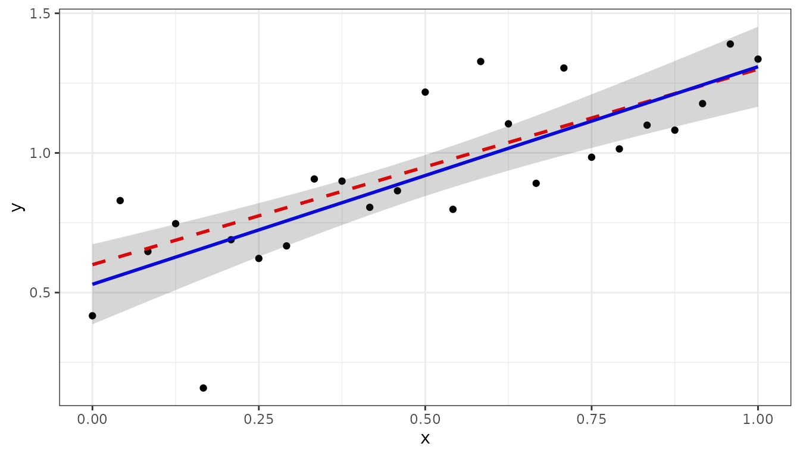

### Fitting a non-linear function.

In this section we will use the following non-linear function $`g(x)`$
on the interval $`x \in [0,1]`$ for the simulations:

``` math
 
   g(x) = 0.3 + 0.4 x + 0.2 \sin(20x)
```

``` r

g <- function(x) { 0.3 + 0.4*x + 0.2*sin(20*x) }
```

The simulated data is generated by the following code

``` r

set.seed(12)
n <- 150
x <- seq(0, 1, length = n)
sigma2e <- 0.04
y <- g(x) + rnorm(n, sd = sqrt(sigma2e))
dat2 <- data.frame(x, y)
```

We can use the `spline` argument to fit the non-linear trend:

``` r

obj2 <- LMMsolve(fixed = y ~ 1, 
                 spline = ~spl1D(x, nseg = 50), 
                 data = dat2)
```

where `spl1D(x, nseg = 50)` defines a mixed model P-splines with 50
segments.

The model fit can be summarized in terms of effective dimensions:

``` r

summary(obj2)
#> Table with effective dimensions and penalties: 
#> 
#>         Term Effective Model Nominal Ratio Penalty
#>  (Intercept)      1.00     1       1  1.00     0.0
#>       lin(x)      1.00     1       1  1.00     0.0
#>         s(x)     11.28    53      51  0.22     0.0
#>     residual    136.72   150     148  0.92    30.3
#> 
#>  Total Effective Dimension: 150
```

The intercept and the slope `lin(x)` define the linear (or fixed) part
of the model, the non-linear (or random) part is defined by `s(x)`, with
effective dimension 11.28.

Making predictions on the interval $`[0,1]`$ and plotting can be done in
the same way as for the linear regression example:

``` r

newdat <- makeGrid(obj2, grid = 300)
pred2 <- predict(obj2, newdata = newdat, se.fit = TRUE)
pred2$y_true <- g(pred2$x)

ggplot(data = dat2, aes(x = x, y = y)) +
  geom_point(col = "black", size = 1.5) +
  geom_line(data = pred2, aes(y = y_true), color = "red", 
            linewidth = 1, linetype ="dashed") +
  geom_line(data = pred2, aes(y = ypred), color = "blue", linewidth = 1) +
  geom_ribbon(data= pred2, aes(x=x, ymin = ypred-2*se, ymax = ypred+2*se),
              alpha=0.2, inherit.aes = FALSE) +
  theme_bw() 
```

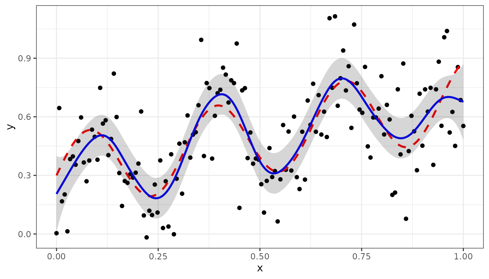

The derivative of the fitted curve can be calculated using the `deriv`
argument in the [`predict()`](https://rdrr.io/r/stats/predict.html)
function:

``` r

dg_dx <- function(x) { 0.4 + 4*cos(20*x) }
pred2_dx <- predict(obj2, newdata = newdat, se.fit = TRUE, deriv="x")
pred2_dx$y_true <- dg_dx(pred2_dx$x)

ggplot(data = pred2_dx) +
  geom_line(aes(x=x, y = y_true), color = "red", 
            linewidth = 1, linetype ="dashed") +
  geom_line(aes(x = x, y = ypred), color = "blue", linewidth = 1) +
  geom_ribbon(aes(x=x, ymin = ypred-2*se, ymax = ypred+2*se),
              alpha=0.2, inherit.aes = FALSE) +
  geom_hline(yintercept=0.0, linetype = "dashed") + ylab('dy/dx') + 
  theme_bw() 
```

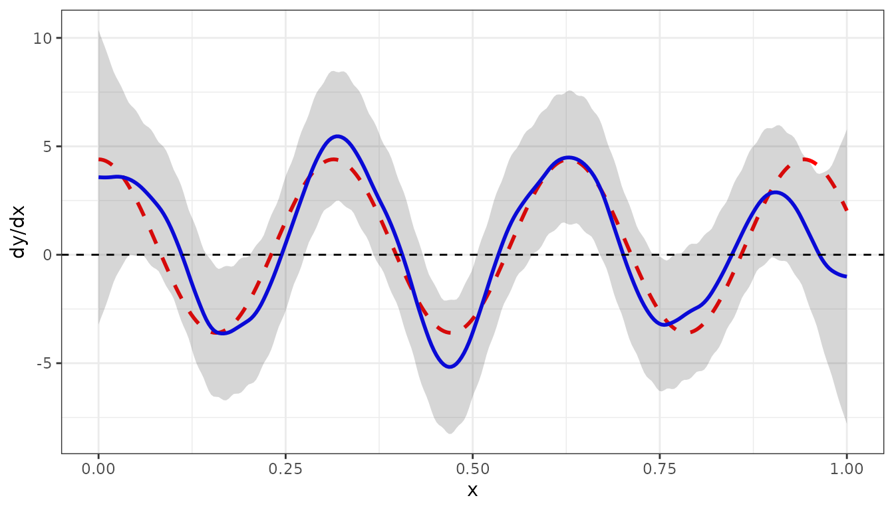

The dashed red curve is the true derivative given by $`g'(x)`$, defined
by

``` math
 
   g'(x) = \frac{dg}{dx} = 0.4 + 4 \cos(20x)  
```

The blue curve is the derivative of the fitted curve.

### Smoothing combining two experiments

In this section we will give a bit more complicated example, to show
some further options of `LMMsolver`. Suppose there are two experiments,
A and B, with the same true unobserved non-linear function `g(x)` as
defined before.

The simulated data is given by the following code:

``` r

set.seed(1234)
nA <-  50
nB <- 100
mu_A <-  0.10
mu_B <- -0.10
sigma2e_A <- 0.04
sigma2e_B <- 0.10

x1 <- runif(n = nA)
x2 <- runif(n = nB)
y1 <- g(x1) + rnorm(nA, sd = sqrt(sigma2e_A)) + mu_A
y2 <- g(x2) + rnorm(nB, sd = sqrt(sigma2e_B)) + mu_B
Experiment <- as.factor(c(rep("A", nA), rep("B", nB)))
dat4 <- data.frame(x = c(x1, x2), y = c(y1,y2), Experiment = Experiment)
```

Before analyzing the data in further detail a boxplot gives some
insight:

``` r

ggplot(dat4, aes(x = Experiment, y = y, fill = Experiment)) +  
  geom_boxplot() + 
  geom_point(position = position_jitterdodge(), alpha = 0.3) 
```

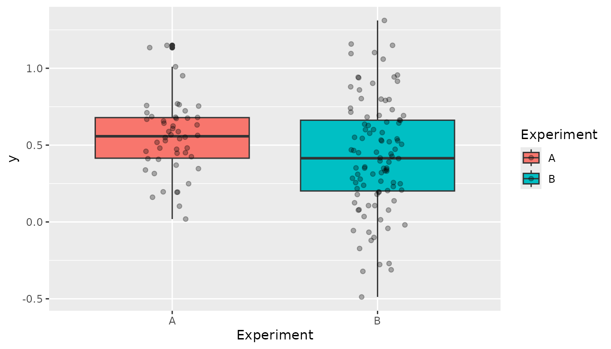

Comparing the two experiments we can see that:

1.  There is a clear difference in mean/median between the two
    experiments. This can be corrected for by adding the argument
    `random = ~Experiment`.
2.  The variance in experiment A is smaller than in B. This implies that
    is important to allow for heterogeneous variances which can be
    modelled by defining `residual = ~Experiment`.

The model in
[`LMMsolve()`](https://biometris.github.io/LMMsolver/index.html/reference/LMMsolve.md)
is given by:

``` r

obj4 <- LMMsolve(fixed= y ~ 1, 
                 spline = ~spl1D(x, nseg = 50, xlim = c(0,1)),
                 random = ~Experiment,
                 residual = ~Experiment,
                 data = dat4)
```

The table of effective dimensions is given by:

``` r

summary(obj4)
#> Table with effective dimensions and penalties: 
#> 
#>            Term Effective Model Nominal Ratio Penalty
#>     (Intercept)      1.00     1       1  1.00    0.00
#>          lin(x)      1.00     1       1  1.00    0.00
#>      Experiment      0.93     2       1  0.93   77.97
#>            s(x)      7.89    53      51  0.15    0.00
#>  Experiment_A!R     43.66    50      50  0.87   32.15
#>  Experiment_B!R     95.52   100     100  0.96    9.01
#> 
#>  Total Effective Dimension: 150
```

And making the predictions:

``` r

newdat <- makeGrid(obj4, grid = 300)
pred4 <- predict(obj4, newdata = newdat, se.fit = TRUE)
pred4$y_true <- g(pred4$x)
ggplot(data = dat4, aes(x = x, y = y, colour = Experiment)) +
  geom_point(size = 1.5) +
  geom_line(data = pred4, aes(y = y_true), color="red", 
            linewidth = 1, linetype = "dashed") +
  geom_line(data = pred4, aes(y = ypred), color = "blue", linewidth = 1) +
  geom_ribbon(data = pred4, aes(x = x,ymin = ypred-2*se, ymax = ypred+2*se),
              alpha = 0.2, inherit.aes = FALSE) + 
  theme_bw()
```

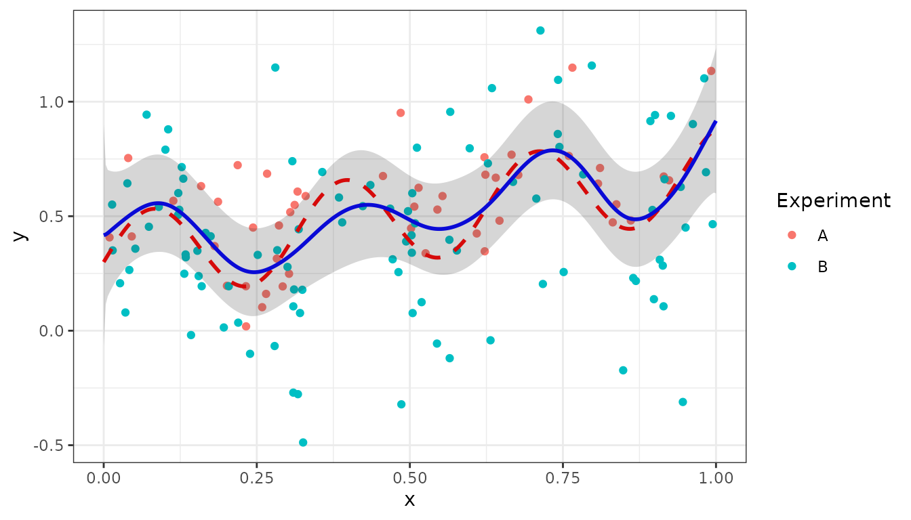

The estimated random effects for Experiment can be obtained using the
[`coef()`](https://rdrr.io/r/stats/coef.html) function:

``` r

coef(obj4)$Experiment
#> Experiment_A Experiment_B 
#>   0.07719844  -0.07719844
```

The sum of the effects is equal to zero, as expected for a standard
random term.

## Smooth trends in two dimensions

For two-dimensional mixed P-splines as defined in Boer
([2023](#ref-boer2023)) we will use two examples. The first example is
US precipitation data. The second example models a data set for Sea
Surface Temperature (SST) described in Cressie et al.
([2022](#ref-cressie2022)).

### US precipitation example

As a first example we use the `USprecip` data set in the spam package
([Furrer and Sain 2010](#ref-Furrer2010)), analysed in Rodríguez-Álvarez
et al. ([2015](#ref-Rodriguez-Alvarez2015)).

``` r

## Get precipitation data from spam
data(USprecip, package = "spam")

## Only use observed data
USprecip <- as.data.frame(USprecip)
USprecip <- USprecip[USprecip$infill == 1, ]
```

The two-dimensional P-spline can be defined with the
[`spl2D()`](https://biometris.github.io/LMMsolver/index.html/reference/spl1D.md)
function, and with longitude and latitude as covariates. The number of
segments chosen here is equal to the number of segments used in
Rodríguez-Álvarez et al. ([2015](#ref-Rodriguez-Alvarez2015)).

``` r

obj5 <- LMMsolve(fixed = anomaly ~ 1,
                 spline = ~spl2D(x1 = lon, x2 = lat, nseg = c(41, 41)),
                 data = USprecip)
```

The summary function gives a table with the effective dimensions and the
penalty parameters:

``` r

summary(obj5)
#> Table with effective dimensions and penalties: 
#> 
#>           Term Effective Model Nominal Ratio Penalty
#>    (Intercept)      1.00     1       1  1.00    0.00
#>  lin(lon, lat)      3.00     3       3  1.00    0.00
#>         s(lon)    302.60  1936    1932  0.16    0.26
#>         s(lat)    409.09  1936    1932  0.21    0.08
#>       residual   5190.31  5906    5902  0.88   13.53
#> 
#>  Total Effective Dimension: 5906
```

A plot for the smooth trend can be obtained in a similar way as for the
one-dimensional examples, using the
[`predict()`](https://rdrr.io/r/stats/predict.html) function. First we
make predictions on a regular two-dimensional grid:

``` r

newdat <- makeGrid(obj5, grid = c(200, 300))
plotDat5 <- predict(obj5, newdata = newdat)
```

For plotting the predictions for USA main land we use the `maps` and
`sf` packages:

``` r

plotDat5 <- sf::st_as_sf(plotDat5, coords = c("lon", "lat"))
usa <- sf::st_as_sf(maps::map("usa", regions = "main", plot = FALSE))
sf::st_crs(usa) <- sf::st_crs(plotDat5)
intersection <- sf::st_intersects(plotDat5, usa)
plotDat5 <- plotDat5[!is.na(as.numeric(intersection)), ]

ggplot(usa) + 
  geom_sf(color = NA) +
  geom_tile(data = plotDat5, 
            mapping = aes(geometry = geometry, fill = ypred), 
            linewidth = 0,
            stat = "sf_coordinates") +
  scale_fill_gradientn(colors = topo.colors(100))+
  labs(title = "Precipitation (anomaly)", 
       x = "Longitude", y = "Latitude") +
  coord_sf() +
  theme(panel.grid = element_blank())
```

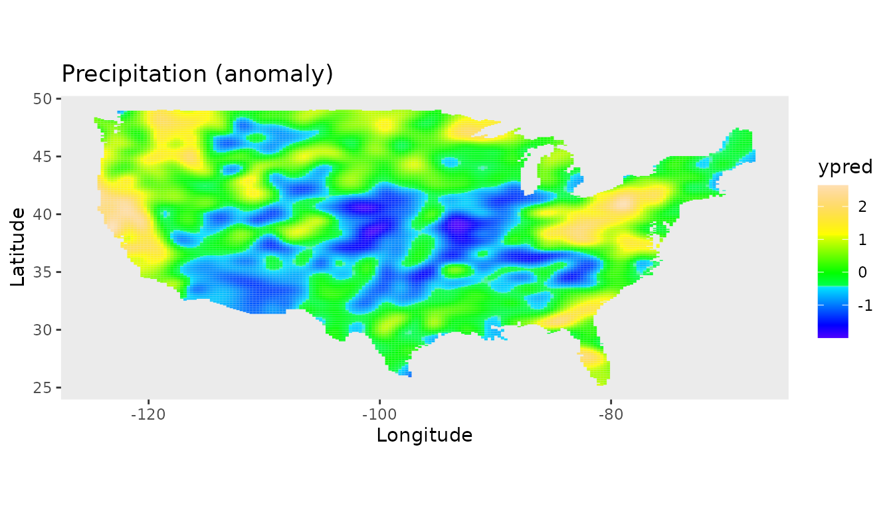

### Sea Surface Temperatures

The second example using two-dimensional P-splines is for Sea Surface
Temperatures (SST) data ([Cressie et al. 2022](#ref-cressie2022)). In
their study they compare a wide range of software packages to analyse
the SST data. For the comparison they focus on a region of the ocean
known as the Brazil-Malvinas confluence zone, an energetic region of the
ocean just off the coast of Argentina and Uruguay, where the warm Brazil
current and the cold Malvinas current meet ([Cressie et al.
2022](#ref-cressie2022)).

They divided the data within this region into a training and a testing
data set, each consisting of approximately 8,000 observations.

``` r

data(SeaSurfaceTemp)
head(SeaSurfaceTemp, 3)
#>        lon      lat    sst  type
#> 1 -51.5607 -38.2629 289.94 train
#> 2 -55.0255 -49.3163 278.60 train
#> 3 -48.4228 -35.7470 291.51 train
table(SeaSurfaceTemp$type)
#> 
#>  test train 
#>  7894  7713
```

First we convert SST from Kelvin to Celsius and split the data in the
training and test set:

``` r

# convert from Kelvin to Celsius
df <- SeaSurfaceTemp
df$sst <- df$sst - 273.15
### split in training and test set
df_train <- df[df$type == "train", ]
df_test <- df[df$type == "test", ]
```

The next plot shows the raw data, using the same color palette as in
Cressie et al. ([2022](#ref-cressie2022)).

``` r

nasa_palette <- c(
  "#03006d","#02008f","#0000b6","#0001ef","#0000f6","#0428f6","#0b53f7",
  "#0f81f3","#18b1f5","#1ff0f7","#27fada","#3efaa3","#5dfc7b","#85fd4e",
  "#aefc2a","#e9fc0d","#f6da0c","#f5a009","#f6780a","#f34a09","#f2210a",
  "#f50008","#d90009","#a80109","#730005"
)

map_layer <- geom_map(
  data = map_data("world"), map = map_data("world"),
  aes(group = group, map_id = region),
  fill = "black", colour = "white", linewidth = 0.1
)

# Brazil-Malvinas confluence zone
BM_box <- cbind(lon = c(-60, -48), lat = c(-50, -35))

ggplot() +
  scale_colour_gradientn(colours = nasa_palette, name = expression(degree*C)) +
  xlab("Longitude (deg)") + ylab("Latitude (deg)") +
  map_layer + xlim(BM_box[, "lon"]) + ylim(BM_box[, "lat"]) + theme_bw() +
  coord_fixed(expand = FALSE) +
  geom_point(data = df_train, aes(lon, lat, colour = sst), size=0.5)
```

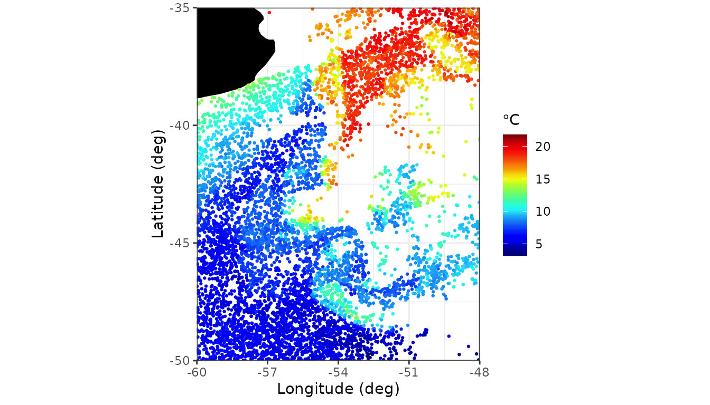

For this complicated data we need more segments for
[`spl2D()`](https://biometris.github.io/LMMsolver/index.html/reference/spl1D.md)
as in the previous example, because of the strong local changes in Sea
Surface Temperatures in this region.

``` r

obj6 <- LMMsolve(fixed = sst ~ 1, 
                 spline = ~spl2D(lon, lat, nseg = c(70, 70),
                                 x1lim = BM_box[, "lon"], x2lim = BM_box[, "lat"]),
                 data = df_train, tolerance = 1.0e-1)
summary(obj6)
#> Table with effective dimensions and penalties: 
#> 
#>           Term Effective Model Nominal Ratio Penalty
#>    (Intercept)      1.00     1       1  1.00    0.00
#>  lin(lon, lat)      3.00     3       3  1.00    0.00
#>         s(lon)    755.49  5329    5325  0.14    0.00
#>         s(lat)    689.68  5329    5325  0.13    0.00
#>       residual   6263.84  7713    7709  0.81    6.65
#> 
#>  Total Effective Dimension: 7713
```

The predictions on a grid are shown in the next figure

``` r

newdat <- makeGrid(obj6, grid = c(200, 200))
pred_grid <- predict(obj6, newdata = newdat, se.fit=TRUE)
pred_grid <- pred_grid[pred_grid$se<5, ]

## Plot predictions on a grid
ggplot(pred_grid) +
  geom_tile(aes(x = lon, y = lat, fill = ypred)) +
  scale_fill_gradientn(colours = nasa_palette) +
  labs(
    fill = "pred.",
    x = "Longitude (deg)", y = "Latitude (deg)"
  ) +
  map_layer +
  theme_bw() +
  coord_fixed(expand = FALSE, xlim = BM_box[, "lon"], ylim = BM_box[, "lat"]) +
  scale_x_continuous(breaks = c(-58, -54, -50))
```

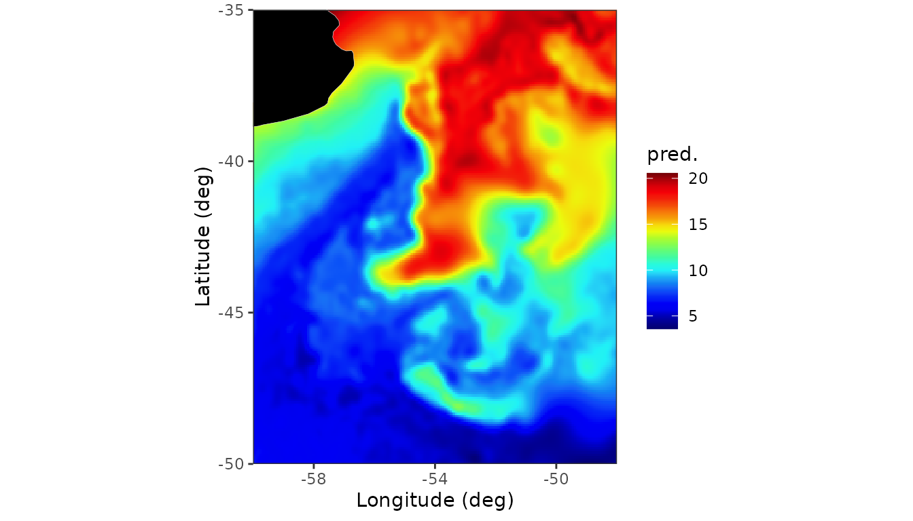

The standard errors for the predictions are in the column `se` in the
data frame `pred_grid` and can be plotted using the following code:

``` r

 ## Plot standard error
ggplot(pred_grid) +
   geom_raster(aes(x = lon, y = lat, fill = se)) +
   scale_fill_distiller(palette = "BrBG", direction = -1) +
   labs( fill = "s.e.", x = "Longitude (deg)", y = "Latitude (deg)") +
   map_layer +
   theme_bw() +
   coord_fixed(expand = FALSE, xlim = c(-60, -48), ylim = c(-50, -35)) +
   scale_x_continuous(breaks = c(-58, -54, -50))
```

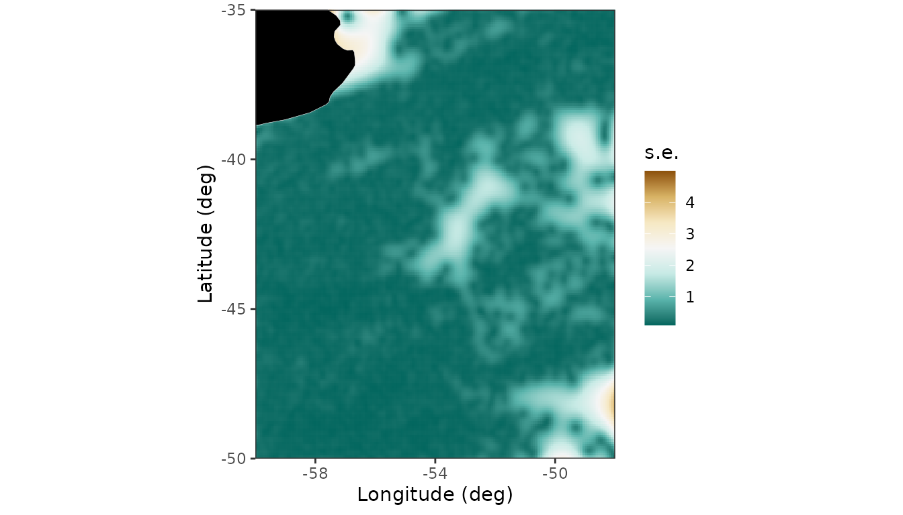

Predictions for the test set are given by

``` r

pred_test <- predict(obj6, newdata = df_test)
ggplot(pred_test, aes(x = sst,y = ypred)) + geom_point() +
     xlab("observed SST (Celsius)") + ylab("predicted SST (Celsius)") +
     geom_abline(intercept=0,slope=1,col='red') + theme_bw()
```

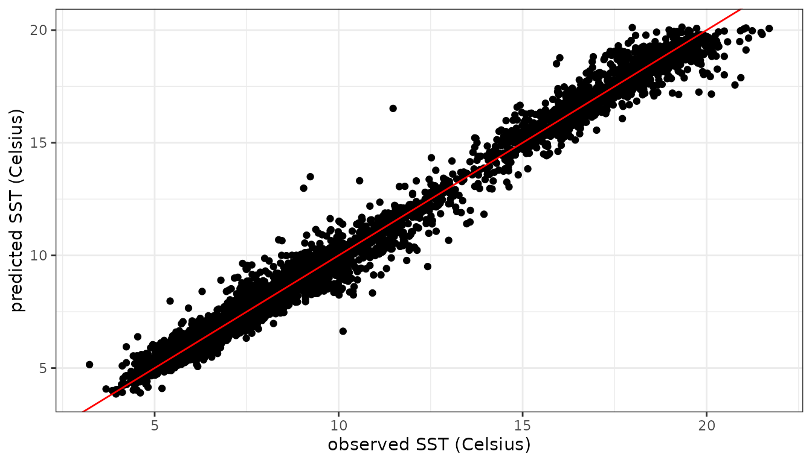

Calculation of the root mean squared prediction error (RMSPE) for the
test set:

``` r

Y <- (pred_test$sst - pred_test$ypred)^2
RMSE <- sqrt(mean(Y))
round(RMSE, 2)
#> [1] 0.45
```

The RMSPE is in the same range (0.44-0.46) as for the software packages
used in Cressie et al. ([2022](#ref-cressie2022)). On a standard desktop
the calculations using `LMMsolver` take less than 10 seconds, taking
advantage of the sparse structure of the P-splines mixed model ([Boer
2023](#ref-boer2023)).

## Generalized Linear Mixed Models.

The `LMMsolver` package can also be used for non-gaussian data, using
the `family` argument, with default `family = gaussian()`.

In this section we will give three examples. The first example is
simulated count data following a Poisson distribution. The second
example is for data following a binomial distribution. The final example
is categorical data using `family = multinomial()`, which is a
generalization of the binomial distribution.

### Modelling count data using Poisson model.

As an example we use count data using the Poisson distribution, defined
by
``` math
 
   \Pr(X=k) = \frac{\lambda^k e^{-\lambda}}{k!} \;,
```
with parameter $`\lambda > 0`$ and $`k`$ is the number of occurrences.
More general, the value of the parameter $`\lambda`$ can depend on
another variable $`x`$, for example time. Here we will assume that $`x`$
is defined on the interval $`[0,1]`$ and defined by:

``` math
  \lambda(x) = 4 + 3x + 4 \sin(7 x)
```
Using this function we simulate the following data

``` r

set.seed(1234)
n <- 150
x <- seq(0, 1, length=n)
fun_lambda <- function(x) { 4 + 3*x + 4*sin(7*x) }
x <- seq(0, 1, length = n)
y <- rpois(n = n, lambda = fun_lambda(x)) 
dat3 <- data.frame(x = x, y = y)
```

Now we fit the data with the argument `family = poisson()`:

``` r

obj3 <- LMMsolve(fixed = y ~ 1, 
                spline = ~spl1D(x, nseg = 50), 
                family = poisson(), 
                data = dat3)
summary(obj3)
#> Table with effective dimensions and penalties: 
#> 
#>         Term Effective Model Nominal Ratio Penalty
#>  (Intercept)      1.00     1       1  1.00       0
#>       lin(x)      1.00     1       1  1.00       0
#>         s(x)      6.54    53      51  0.13       0
#>     residual    141.46   150     148  0.96       1
#> 
#>  Total Effective Dimension: 150
```

Making predictions and plotting the data is similar to the Gaussian data
we showed before:

``` r

newdat <- makeGrid(obj3, grid = 300)
pred3 <- predict(obj3, newdata = newdat, se.fit = TRUE)
pred3$y_true <- fun_lambda(pred3$x)

ggplot(data = dat3, aes(x = x, y = y)) +
  geom_point(col = "black", size = 1.5) +
  geom_line(data = pred3, aes(y = y_true), color = "red", 
            linewidth = 1, linetype ="dashed") +
  geom_line(data = pred3, aes(y = ypred), color = "blue", linewidth = 1) +
  geom_ribbon(data= pred3, aes(x=x, ymin = ypred-2*se, ymax = ypred+2*se),
              alpha=0.2, inherit.aes = FALSE) +
  theme_bw() 
```

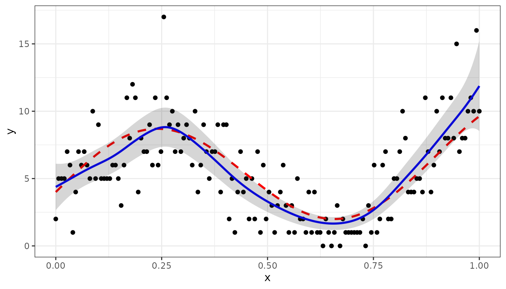

### Binomial distribution

The binomial distribution is given by:
``` math
 
   \Pr(X=k) = \frac{n!}{k! (n-k)!} p^{n} (1-p)^{n-k} \;,
```
where $`n`$ is number of observations, $`p`$ the probability on succes
per observation, and $`k`$ is the number of successes (and $`n-k`$
failures).

Similar as in previous section we will assume that the probability $`p`$
is a non-linear function of $`x`$ ($`x \in [0,1]`$)
``` math
  p(x) = 0.5 + 0.4 \sin(2 \pi x)
```
The following code simulates the data:

``` r

set.seed(1234)
n <- 100
sz <- 10

fun_prob <- function(x) { 0.5 + 0.4*sin(2*pi*x) }

x <- seq(0, 1, length=n)
nsucces <- sapply(x, FUN=function(x) {
                  rbinom(n=1, size = sz, prob = fun_prob(x))
                })
dat <- data.frame(x = x, succes = nsucces, 
                         failure= sz - nsucces)
head(dat, 3)
#>            x succes failure
#> 1 0.00000000      3       7
#> 2 0.01010101      5       5
#> 3 0.02020202      5       5
```

Next we can analyse the data using `family = binomial()`, and for the
response using `cbind(succes, failure)`:

``` r

obj3 <- LMMsolve(fixed = cbind(succes, failure) ~ 1,
                 spline = ~spl1D(x, nseg = 50),
                 family = binomial(),
                 data = dat)
summary(obj3)
#> Table with effective dimensions and penalties: 
#> 
#>         Term Effective Model Nominal Ratio Penalty
#>  (Intercept)      1.00     1       1  1.00       0
#>       lin(x)      1.00     1       1  1.00       0
#>         s(x)      5.85    53      51  0.11       0
#>     residual     92.15   100      98  0.94       1
#> 
#>  Total Effective Dimension: 100
```

Making predictions can be done as shown before in the other examples:

``` r

newdat <- data.frame(x = seq(0, 1, by=0.01))
pred3 <- predict(obj3, newdata = newdat, se.fit=TRUE)
```

Finally, the next R-chunk generates the figure, where the black points
are the fraction of successes, the red dashed curve is the true
probability, and the blue curve are the predictions:

``` r

pred3$y_true <- fun_prob(pred3$x)
dat$y <- dat$succes/sz

ggplot(data = dat, aes(x = x, y = y)) +
  geom_point(col = "black", size = 1.5) +
  geom_line(data = pred3, aes(y = y_true), color = "red",
            linewidth = 1, linetype = "dashed") +
  geom_line(data = pred3, aes(y = ypred), color = "blue", linewidth = 1) +
  geom_ribbon(data= pred3, aes(x=x, ymin = ypred-2*se, ymax = ypred+2*se),
              alpha=0.2, inherit.aes = FALSE) +
  theme_bw()
```

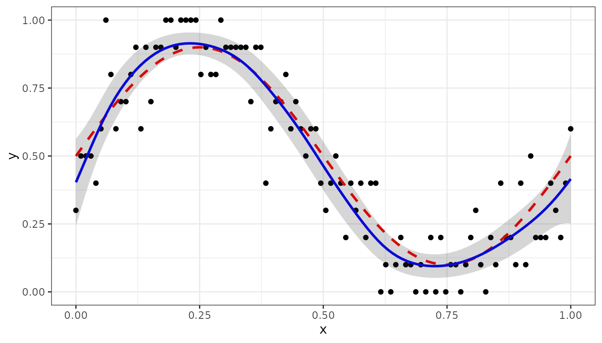

### Multinomial distribution

The multinomial distribution is a generalization of the binomial
distribution. The fitting of multinomial responses is more complicated
than the standard GLMMs, for details see Fahrmeir et al.
([2013](#ref-fahrmeir2013)).

For $`k`$ categories we have:
``` math
 
   \Pr(X_1=x_1,X_2=x_2, \ldots, X_k = x_k) = \frac{n!}{x_1! x_2! \cdots x_k!} p_1^{x_1} \cdot p_2^{x_2} \cdots p_k^{x_k} \;,
```
with $`\sum_{i=1}^k p_i = 1`$ and $`\sum_{i=1}^k x_i = n`$.

In the following we will give an example with four categories (A, B, C,
D), where probabilities $`p_i`$ depend on a single variable $`x`$:

``` r

k <- 4
mu <- c(0.1, 0.4, 0.6, 0.9)
names(mu) <- LETTERS[1:k]

nonlinear <- function(x, mu) {
  z <- sapply(mu, function(mu) { exp(-8*sin(pi*(x-mu))^2)})
  # normalize to sum equal to one
  z <- z/sum(z)
  return(z)
}
```

Next we simulate the data:

``` r

x <- runif(n, 0, 1)   
sz <- 10 
multiNom <- t(sapply(x, FUN=
                      function(x) {
                        rmultinom(n=1, size=sz, prob = nonlinear(x,mu))
                      } ))
colnames(multiNom) <- names(mu)
dat <- data.frame(x, multiNom)
head(dat, 3)
#>            x A B C D
#> 1 0.03545673 7 0 0 3
#> 2 0.56507611 0 1 9 0
#> 3 0.28025778 2 8 0 0
```

``` r

obj <- LMMsolve(fixed = cbind(A,B,C,D) ~ 1,
                spline = ~spl1D(x, nseg = 17, xlim = c(0,1)),
                data = dat, 
                family = multinomial())
summary(obj)
#> Table with effective dimensions and penalties: 
#> 
#>         Term Effective Model Nominal Ratio Penalty
#>  (Intercept)      3.00     3       3  1.00       0
#>       lin(x)      3.00     3       3  1.00       0
#>         s(x)      6.03    60      54  0.11       0
#>     residual    287.97   300     294  0.98       1
#> 
#>  Total Effective Dimension: 300
```

The predictions are given by:

``` r

sRows <- rowSums(multiNom)
fr <- multiNom/sRows
dat_fr <- data.frame(x, fr)

x0 <- seq(0, 1, by = 0.01)
newdat <- data.frame(x = x0)
pred <- predict(obj, newdata = newdat)
head(pred, 3)
#>      x category     ypred
#> 1 0.00        A 0.9051117
#> 2 0.01        A 0.9117668
#> 3 0.02        A 0.9178041
```

The following code generates the plot with prediction, with the points
the observed fractions, the dashed curves the true probabilities and the
solid curves the predicted values:

``` r

library(tidyr)
colnames(pred) <- c("x", "category", "y")
prob_true <- t(sapply(X=x0, FUN = function(x) { nonlinear(x, mu)}))
colnames(prob_true) <- names(mu)
df_true <- data.frame(x = x0, prob_true)
prob_true_lf <- df_true %>% gather(key = "category",value="y", A:D)
dat_fr_lf <- dat_fr %>% gather(key = "category",value="y", A:D)
p1 <- ggplot(prob_true_lf, aes(x = x, y=y, color = category)) +
  geom_line(linetype='dashed') +
  geom_line(data=pred) +
  geom_point(data=dat_fr_lf)
p1
```

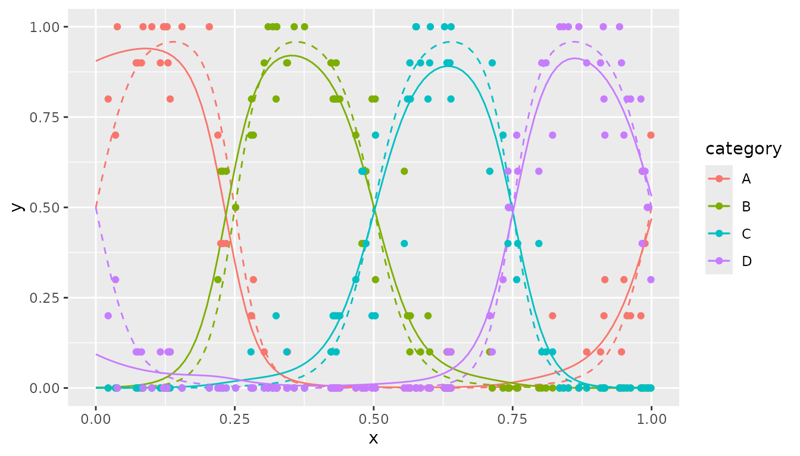

## Examples in Quantitative Genetics and Agriculture

In this section we will show some examples from agriculture and
quantitative genetics, to illustrate some further options of the
package.

### Linear Variance model oats data

As a first example we will use an oats field trial. There were 24
varieties in 3 replicates, each consisting of 6 incomplete blocks of 4
plots. The plots were laid out in a single row ([John and Williams
1995](#ref-john1995); [Boer et al. 2020](#ref-Boer2020)).

``` r

## Load data.
data(oats.data)
head(oats.data, 3)
#>   plot rep block gen  yield row col
#> 1    1  R1    B1 G11 4.1172   1   1
#> 2    2  R1    B1 G04 4.4461   2   1
#> 3    3  R1    B1 G05 5.8757   3   1
```

We will use the Linear Variance (LV) model, which is closely connected
to the P-splines model ([Boer et al. 2020](#ref-Boer2020)). First we
need to define the precision matrix for the LV model, see Appendix in
Boer et al. ([2020](#ref-Boer2020)) for details:

``` r

## Add plot as factor.
oats.data$plotF <- as.factor(oats.data$plot)
## Define the precision matrix, see eqn (A2) in Boer et al (2020).
N <- nrow(oats.data)
cN <- c(1 / sqrt(N - 1), rep(0, N - 2), 1 / sqrt(N - 1))
D <- diff(diag(N), diff = 1)
Delta <- 0.5 * crossprod(D)
LVinv <- 0.5 * (2 * Delta + cN %*% t(cN))
lGinv <- list(plotF = LVinv)

LVinv <- Matrix::Matrix(LVinv, sparse = TRUE)
rownames(LVinv) <- colnames(LVinv) <- as.character(seq_len(nrow(LVinv)))
## Add LVinv to list, with name corresponding to random term.
lGinv <- as.ginverse(list(plotF = LVinv))
```

Given the precision matrix for the LV model we can define the model in
LMMsolve using the `random` and `ginverse` arguments:

``` r

obj7 <- LMMsolve(fixed = yield ~ rep + gen,
                 random = ~plotF, 
                 ginverse = lGinv, 
                 data = oats.data)
```

The absolute deviance ($`-2*logL`$) and variances for the LV-model are

``` r

round(deviance(obj7, relative = FALSE), 2)
#> [1] 54.49
summary(obj7, which = "variances")
#> Table with variances: 
#> 
#>   VarComp Variance
#>     plotF     0.01
#>  residual     0.06
```

as reported in Boer et al. ([2020](#ref-Boer2020)), Table 1.

### Generalized Heritability

In this section we use the same oats data set as in the previous
section, to illustrate how the generalized heritability ([Oakey et al.
2006](#ref-oakey2006); [Rodríguez-Álvarez et al.
2018](#ref-Rodriguez-Alvarez2018)) can be obtained.

We use the model as described in Schmidt et al.
([2019](#ref-schmidt2019)), with genotype random:

``` r

obj7b <- LMMsolve(fixed = yield ~ rep,
                 random = ~gen + rep:block, 
                 data = oats.data)
```

The generalized heritability for `gen` is given by the ratio of the
Effective Dimension, divided by the nominal number of parameters ([Oakey
et al. 2006](#ref-oakey2006); [Rodríguez-Álvarez et al.
2018](#ref-Rodriguez-Alvarez2018)).

The heritability can be obtained directly using the
[`getHeritability()`](https://biometris.github.io/LMMsolver/index.html/reference/getHeritability.md)
function:

``` r

round(getHeritability(obj7b, geno.term = "gen"), 3)
#> [1] 0.809
```

and corresponds to the result for the Oakey model in Schmidt et al.
([2019](#ref-schmidt2019)).

### Modelling longitudinal data

In this section we show an example of mixed model P-splines to fit
biomass as function of time. As an example we use wheat data simulated
with the crop growth model APSIM. This data set is included in the
package. For details on this simulated data see Bustos-Korts et al.
([2019](#ref-Bustos-Korts2019)).

``` r

data(APSIMdat)
head(APSIMdat, 3)
#>            env geno das  biomass
#> 1 Emerald_1993 g001  20 65.57075
#> 2 Emerald_1993 g001  21 60.70499
#> 3 Emerald_1993 g001  22 74.06247
```

The first column is the environment, Emerald in 1993, the second column
the simulated genotype (g001), the third column is days after sowing
(das), and the last column is the simulated biomass with medium
measurement error.

The model can be fitted with

``` r

obj8 <- LMMsolve(fixed = biomass ~ 1,
                 spline = ~spl1D(x = das, nseg = 50), 
                 data = APSIMdat)
```

The effective dimensions are:

``` r

summary(obj8)
#> Table with effective dimensions and penalties: 
#> 
#>         Term Effective Model Nominal Ratio Penalty
#>  (Intercept)      1.00     1       1  1.00    0.00
#>     lin(das)      1.00     1       1  1.00    0.00
#>       s(das)      6.46    53      51  0.13    0.01
#>     residual    112.54   121     119  0.95    0.00
#> 
#>  Total Effective Dimension: 121
```

The fitted smooth trend can be obtained as explained before:

``` r

newdat <- makeGrid(obj8, grid = 300)
pred8 <- predict(obj8, newdata = newdat, se.fit = TRUE)
ggplot(data = APSIMdat, aes(x = das, y = biomass)) +
  geom_point(size = 1.0) +
  geom_line(data = pred8, aes(y = ypred), color = "blue", linewidth = 1) +
  geom_ribbon(data = pred8, aes(x = das,ymin = ypred-2*se, ymax = ypred+2*se),
              alpha = 0.2, inherit.aes = FALSE) + 
    labs(title = "APSIM biomass as function of time", 
       x = "days after sowing", y = "biomass (kg)") +
  theme_bw()
```

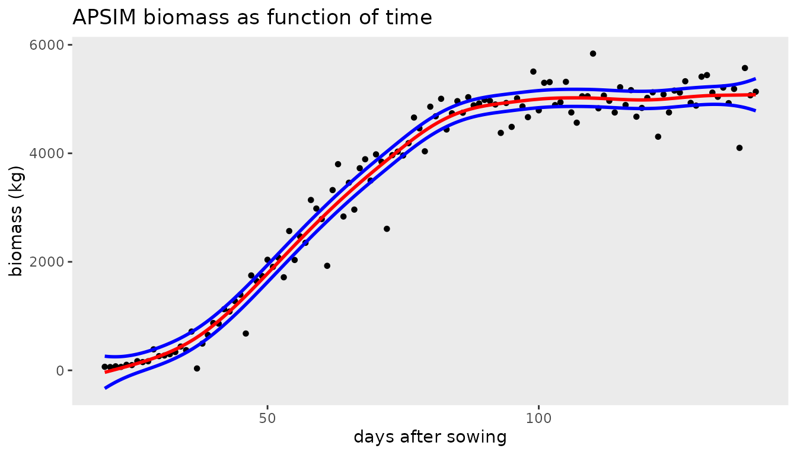

The growth rate (first derivative) as function of time can be obtained
using the `deriv` argument in the
[`predict()`](https://rdrr.io/r/stats/predict.html) function:

``` r

plotDatDt <- predict(obj8, newdata = newdat, se.fit=TRUE, deriv="das")

ggplot(data = plotDatDt, aes(x = das, y = ypred)) +
  geom_line(color = "blue", linewidth = 1) +
  geom_ribbon(aes(x=das, ymin = ypred-2*se, ymax = ypred+2*se),
              alpha=0.2, inherit.aes = FALSE) +  
  labs(title = "APSIM growth rate as function of time", 
       x = "days after sowing", y = "growth rate (kg/day)") +
  theme_bw()
```

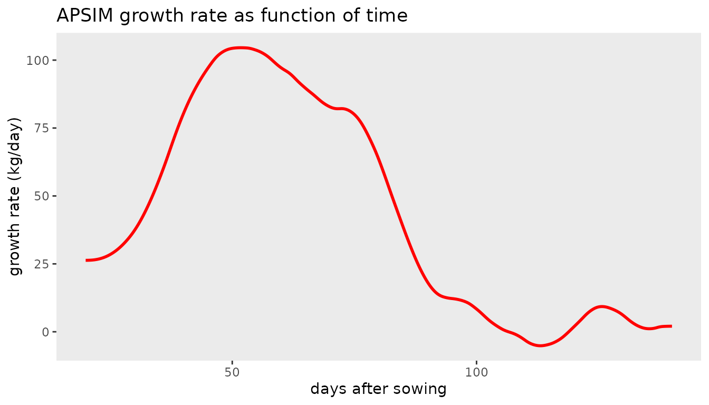

### QTL mapping using IBDs

In QTL-mapping for multiparental populations the Identity-By-Descent
(IBD) probabilities are used as genetic predictors in the mixed model
([Li et al. 2021](#ref-Li2021)). The following simulated example is for
illustration. It consists of three parents (A, B, and C), and two
crosses AxB, and AxC. AxB is a population of 100 Doubled Haploids (DH),
AxC of 80 DHs. The probabilities, pA, pB, and pC, are for a position on
the genome close to a simulated QTL. This simulated data is included in
the package.

``` r

## Load data for multiparental population.
data(multipop)
head(multipop, 3)
#>   cross     ind        pA         pB pC    pheno
#> 1   AxB AxB0001 0.1725882 0.82741184  0 9.890637
#> 2   AxB AxB0002 0.8217079 0.17829207  0 6.546568
#> 3   AxB AxB0003 0.9596844 0.04031561  0 7.899249
```

The residual (genetic) variances for the two populations can be
different. Therefore we need to allow for heterogeneous residual
variances, which can be defined by using the `residual` argument in
`LMMsolve`:

``` r

## Fit null model.
obj9 <- LMMsolve(fixed = pheno ~ cross, 
                 residual = ~cross, 
                 data = multipop)
dev0 <- deviance(obj9, relative = FALSE)
```

The QTL-probabilities are defined by the columns pA, pB, pC, and can be
included in the random part of the mixed model by using the `group`
argument:

``` r

## Fit alternative model - include QTL with probabilities defined in columns 3:5 
lGrp <- list(QTL = 3:5)
obj10 <- LMMsolve(fixed = pheno ~ cross, 
                 group = lGrp,
                 random = ~grp(QTL),
                 residual = ~cross,
                 data = multipop) 
dev1 <- deviance(obj10, relative = FALSE)
```

The approximate $`-log10(p)`$ value is given by

``` r

## Deviance difference between null and alternative model.
dev <- dev0 - dev1
## Calculate approximate p-value. 
minlog10p <- -log10(0.5 * pchisq(dev, 1, lower.tail = FALSE))
round(minlog10p, 2)
#> [1] 8.76
```

The estimated QTL effects of the parents A, B, and C are given by:

``` r

coef(obj10)$QTL
#>     QTL_pA     QTL_pB     QTL_pC 
#> -1.2676362  0.6829275  0.5847088
```

## References

Boer, Martin P. 2023. “Tensor Product P-Splines Using a Sparse Mixed
Model Formulation.” *Statistical Modelling* 23 (5-6): 465–79.
<https://doi.org/10.1177/1471082X231178591>.

Boer, Martin P., Hans-Peter Piepho, and Emlyn R. Williams. 2020. “Linear
Variance, P-splines and Neighbour Differences for Spatial Adjustment in
Field Trials: How are they Related?” *J. Agric. Biol. Environ. Stat.* 25
(4): 676–98. <https://doi.org/10.1007/S13253-020-00412-4>.

Bustos-Korts, Daniela, Martin P. Boer, Marcos Malosetti, et al. 2019.
“Combining Crop Growth Modeling and Statistical Genetic Modeling to
Evaluate Phenotyping Strategies.” *Front. Plant Sci.* 10 (November).
<https://doi.org/10.3389/fpls.2019.01491>.

Carollo, Angela, Paul Eilers, Hein Putter, and Jutta Gampe. 2024.
“Smooth Hazards with Multiple Time Scales.” *Statistics in Medicine*,
ahead of print. <https://doi.org/10.1002/sim.10297>.

Cressie, Noel, Matthew Sainsbury-Dale, and Andrew Zammit-Mangion. 2022.
“Basis-Function Models in Spatial Statistics.” *Annual Review of
Statistics and Its Application* 9 (1): 373–400.
<https://doi.org/10.1146/annurev-statistics-040120-020733>.

Eilers, PHC, and BD Marx. 1996. “Flexible smoothing with B-splines and
penalties.” *Stat. Sci.* <https://www.jstor.org/stable/2246049>.

Fahrmeir, Ludwig, Thomas Kneib, Stefan Lang, et al. 2013. *Regression
Models*. Springer.

Furrer, R, and SR Sain. 2010. “spam: A sparse matrix R package with
emphasis on MCMC methods for Gaussian Markov random fields.” *J. Stat.
Softw.*, ahead of print. <https://doi.org/10.18637/jss.v036.i10>.

John, J. A., and E. R. Williams. 1995. *Cyclic and Computer Generated
Designs*. Chapman; Hall, London.

Li, Wenhao, Martin P. Boer, Chaozhi Zheng, Ronny V. L. Joosen, and Fred
A. van Eeuwijk. 2021. “An IBD-based mixed model approach for QTL mapping
in multiparental populations.” *Theor. Appl. Genet. 2021* 1 (August):
1–18. <https://doi.org/10.1007/S00122-021-03919-7>.

Oakey, Helena, Arūnas Verbyla, Wayne Pitchford, Brian Cullis, and Haydn
Kuchel. 2006. “Joint Modeling of Additive and Non-Additive Genetic Line
Effects in Single Field Trials.” *Theoretical and Applied Genetics* 113
(5): 809–19. <https://doi.org/10.1007/s00122-006-0333-z>.

Patterson, HD, and R Thompson. 1971. “Recovery of inter-block
information when block sizes are unequal.” *Biometrika*, ahead of print.
<https://doi.org/10.1093/biomet/58.3.545>.

Rodríguez-Álvarez, María Xosé, Martin P. Boer, Fred A. van Eeuwijk, and
Paul H. C. Eilers. 2018. “Correcting for spatial heterogeneity in plant
breeding experiments with P-splines.” *Spat. Stat.* 23 (March): 52–71.
<https://doi.org/10.1016/J.SPASTA.2017.10.003>.

Rodríguez-Álvarez, María Xosé, Dae Jin Lee, Thomas Kneib, María Durbán,
and Paul Eilers. 2015. “Fast smoothing parameter separation in
multidimensional generalized P-splines: the SAP algorithm.” *Stat.
Comput.* 25 (5): 941–57. <https://doi.org/10.1007/S11222-014-9464-2>.

Schmidt, Paul, Jens Hartung, Jörn Bennewitz, and Hans-Peter Piepho.
2019. “Heritability in Plant Breeding on a Genotype-Difference Basis.”
*Genetics* 212 (4): 991–1008.
<https://doi.org/10.1534/genetics.119.302134>.
